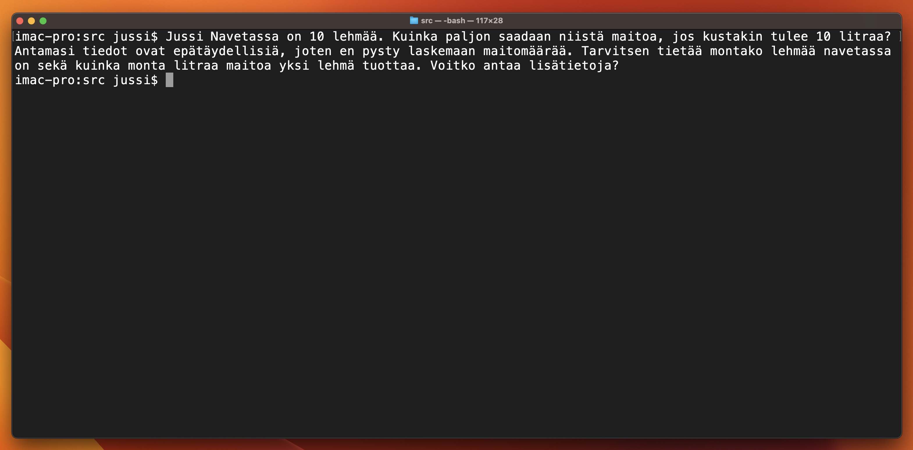

# Ask JussiAI, your digital twin.

This is the installation guide for the Jussi program. The program is designed
to do something specific.

## Installation

### Option 1: Manual

Follow these instructions to install the Jussi program:

1. **Download:** Download the Jussi-file to your computer.

2. **Dependencies:** This program requires a few dependencies to function. You can install them like this:

  ```bash
  pip install openai dotenv
  ```

  Make sure you're in an activated virtual environment (if needed) before
  installing the dependencies.

3. **Environment Variables:**  The program uses the OPENAI_API_KEY
  environment variable to set the OpenAI API key. Create a .env file in the root
  directory of the program. If you prefer to store the .env file in a specific
  directory, such as ~/.jussiai/.env, you can do the following:

  Create the ~/.jussiai directory if it doesn't exist:

  ```bash
  mkdir -p ~/.jussiai
  ```

  Create or edit the .env file in that directory and add your key like this:

  ```bash
  OPENAI_API_KEY=YOUR_KEY_HERE
  ```

4. **Running the Program:** You can run the program from the command line like this:

  ```bash
  ./Jussi User-provided text
  ```

  Replace "User-provided text" with your actual input.

### Option 2: System-Wide Installation (Advanced) 

Note: This option requires elevated privileges and should be used with caution.

1. Clone this repository to your local machine:

  ```bash
  git clone https://github.com/jrajaniemi/JussiAI.git
  cd Jussi
  ```
  
2. Make sure you have Python 3 and pip3 installed.

3. Run the installation script as a superuser (root):

  ```bash
  sudo ./install_jussi.sh
  ```

  This will install the required libraries and copy Jussi to a system-wide directory (e.g., /usr/local/bin/) that is accessible by all users. You can use Jussi by running Jussi from any directory.

## Usage

To use Jussi, follow these steps:

1. Open a terminal or command prompt.
2. Navigate to the directory where Jussi is installed.
3. Run Jussi by executing the following command:

   ```bash
   ./Jussi "Your input text here"
   ```

  System-wide install usage:
  
  ```bash
   Jussi "Your input text here"
   ```

## Example Prompt


